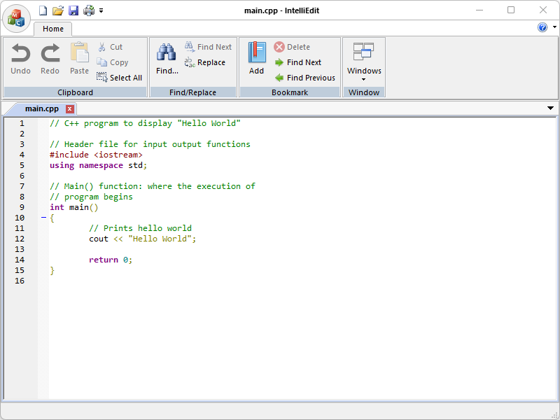

Download:
- [IntelliEditSetup.msi](https://www.moga.doctor/freeware/IntelliEditSetup.msi)
- [IntelliEdit.zip](https://www.moga.doctor/freeware/IntelliEdit.zip)
- [Release Notes](https://www.moga.doctor/freeware/ReleaseNotes.html)
- [Software Content Register](https://www.moga.doctor/freeware/SoftwareContextRegister.html)

## Introduction

_IntelliEdit_ is a free (as in “free speech” and also as in “free beer”) source code editor and Microsoft Notepad replacement that supports several languages. Running in the Microsoft Windows environment, its use is governed by [GNU General Public License v3.0](https://www.gnu.org/licenses/gpl-3.0.html). Based on the powerful editing component Scintilla, _IntelliEdit_ is written in C++ and uses pure Win32 API and STL which ensures a higher execution speed and smaller program size. By optimizing as many routines as possible without losing user friendliness, _IntelliEdit_ is trying to reduce the world carbon dioxide emissions. When using less CPU power, the PC can throttle down and reduce power consumption, resulting in a greener environment. I hope you enjoy _IntelliEdit_ as much as I enjoy coding it!

## Getting started

### Install IntelliEdit using the installer

- Download the installer
- Run the executable binary and follow the installation flow

The installer will likely require Administrative privileges in order to install _IntelliEdit_ (and later, to update _IntelliEdit_ or install or update plugins, or anything else that requires writing to the installation directory). If you do not have Administrative privileges, you either need to tell the installer to use a location where you do have write permission (though that may still ask for Administrator privileges), or you may choose not use the installer and instead run a portable edition from a directory where you have write permission.

### Install IntelliEdit from zip

These instructions will allow you to run a portable or mini-portable (also called “minimalist”), without requiring administrative privileges.

- Create a new folder somewhere that you have write-permission
- Unzip the content into the new folder
- Run _IntelliEdit_ from the new folder

For all the portable editions, everything (the application, settings, and plugins) is stored in one folder hierarchy. And by default, the portable editions do not mess with operating system settings (so no file associations or Edit with _IntelliEdit_ context-menu entries) – if you want such with a portable edition, you will have to set it up manually.

The portable zip edition contain all the themes, user defined languages, auto-completions, localizations, and default plugins and Plugins Admin tool that come with the installed version of _IntelliEdit_.

The portable zip edition of _IntelliEdit_ can be removed by deleting the directory they came in. If you manually set up file associations or context-menu entries in the OS, it is your responsibility to remove them yourself.

## Working with Files

A “file” is the basic unit of what is edited in _IntelliEdit_, but that term actually covers multiple related concepts. Primarily, the “file” is the series of bytes stored on a disk or other storage medium and accessed through your computer’s filesystem; and pedantically, if the document you are editing has never been saved to the filesystem, it’s not technically a file, though common usage applies that term to unsaved documents as well. The “document” refers to the text being edited, whether it’s a new, unsaved document, or whether it’s a document that’s been previously saved as a file on the filesystem. And finally, in _IntelliEdit_, each document is presented in a Tab in one of the two Views of the _IntelliEdit_ user interface, which are the graphical containers which _IntelliEdit_ uses to manipulate files and other documents, though many users think of the user interface element as the “file” as well.

The **main button** contains many of the normal file-operation actions found in most applications. _IntelliEdit_ also includes other custom actions which are useful to understand.

- **New**: Creates a new document, and displays that empty document in a Tab in the active View.
- **Open**: Opens an existing file from the filesystem, and displays that document in a Tab in the active View.
- **Save**: Saves the current document to the filesystem using the same filename. 
If the document does not currently have a file associated with it, this action will be grayed out and the menu entry cannot be used. Use **Save As** instead.
- **Save As**: Saves the current document to the filesystem, prompting for the new filename to use. 
If the document had previously been saved to a file, this will create as new copy of the file, and _IntelliEdit_ will continue working with the document associated with the new file, leaving the old file with the contents that were last saved.
- **Close**: Closes the active document, prompting to save if it has been modified since it was opened or created.
- The **Print** action will pull up a Windows-standard print dialog, from which you can choose your printer and send your text to the selected printer. 
Normally, it will print the whole document, but you can use the print dialog to choose only certain pages; if you have an active selection in the editor, only the selected text will be printed.
- **Exit**: Closes the _IntelliEdit_ application.

The **Clipboard** menu features typical editing commands which any Windows user should be familiar with:

- **Undo**: reverts the text to its content before the previous operation; can be used one or more times consecutively to step back through a document’s textual history.
- **Redo**: if **Undo** was executed previously, this will reinstate the change(s) previously undone; may be executed multiple times.
- **Cut**: will remove any selected text from the document and place it on the Windows clipboard.
- **Copy**: will put a copy of any selected text on the Windows clipboard; document content is unaltered.
- **Paste**: if the Windows clipboard contains text, this will insert a copy of that text at the point of the caret; if text is selected when this command is executed, the selected text will be replaced by the text from the clipboard; if the clipboard does not contain text, nothing will happen.
- **Delete**: will remove any selected text from the document.
- **Select All**: selects all text in the document into a stream selection.

The **Find/Replace** dialogs have certain features in common, though some are not available (greyed out) under certain circumstances.

- **Find what**: This is the text you are searching for.
- **Replace with**: This is the text that will replace what was matched.
- **Match whole word only:** If checked, searches will only match if the result is a whole word (so "it" will not be found inside "hitch").
- **Match case:** If checked, searches must match in case (so a search for "it" will not find "It" or "IT").
- **Regular Expression:** Uses the Boost regular expression engine to perform very powerful search and replace actions.

The various action buttons available include:

- **Find Next**: Finds the next matching text.
- **Replace**: Replaces the currently-selected match. (If no match is currently selected, it behaves like Find Next and just highlights the next match in the specified direction.)
- **Replace All**: It makes one pass through the active document, from the very top to the very bottom, and replaces all occurrences found.

The **Bookmark** menu allows you to navigate and manipulate Bookmarks.

- **Add**: Adds the Bookmark indicator on the active line.
- **Delete**: Deletes the Bookmark indicator on the active line.
- **Find Next**: Navigates to the next Bookmark in the active document.
- **Find Previous**: Navigates to the previous Bookmark in the active document.

## Supported Programming Languages

The following Programming Languages are supported by _IntelliEdit_:

- ASP
- Bash
- Batch
- C/C++
- C#
- CMake
- CSS
- Groovy
- HTML
- Java
- JavaScript
- JSON
- Makefile
- Markdown
- MATLAB
- PHP
- Python
- R
- Rust
- SQL
- XML

## Create and Submit your Pull Request

As noted in the [Contributing Rules](https://github.com/mihaimoga/IntelliEdit/blob/main/CONTRIBUTING.md) for _IntelliEdit_, all Pull Requests need to be attached to a issue on GitHub. So the first step is to create an issue which requests that the functionality be improved (if it was already there) or added (if it was not yet there); in your issue, be sure to explain that you have the functionality definition ready, and will be submitting a Pull Request. The second step is to use the GitHub interface to create the Pull Request from your fork into the main repository. The final step is to wait for and respond to feedback from the developers as needed, until such time as your PR is accepted or rejected.
